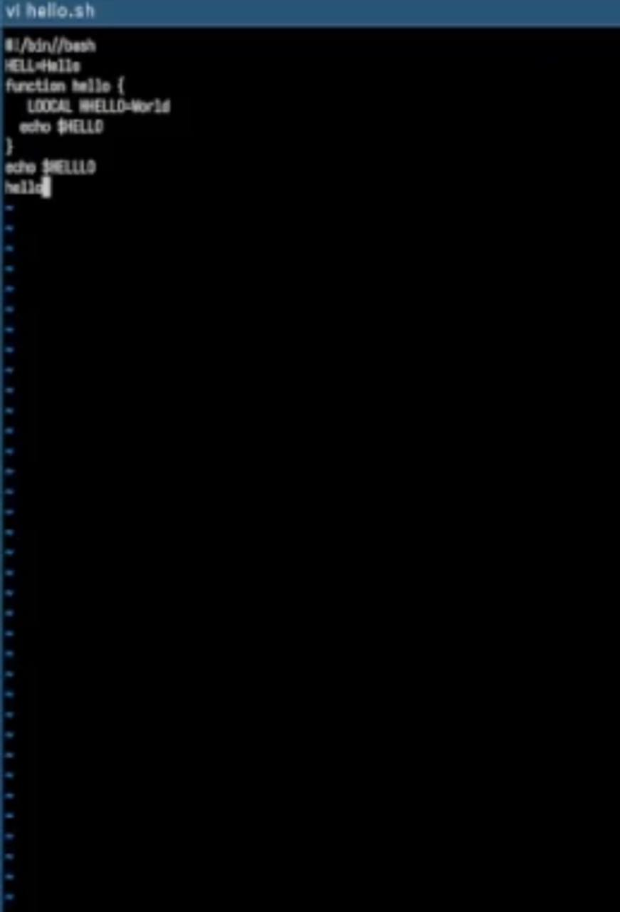
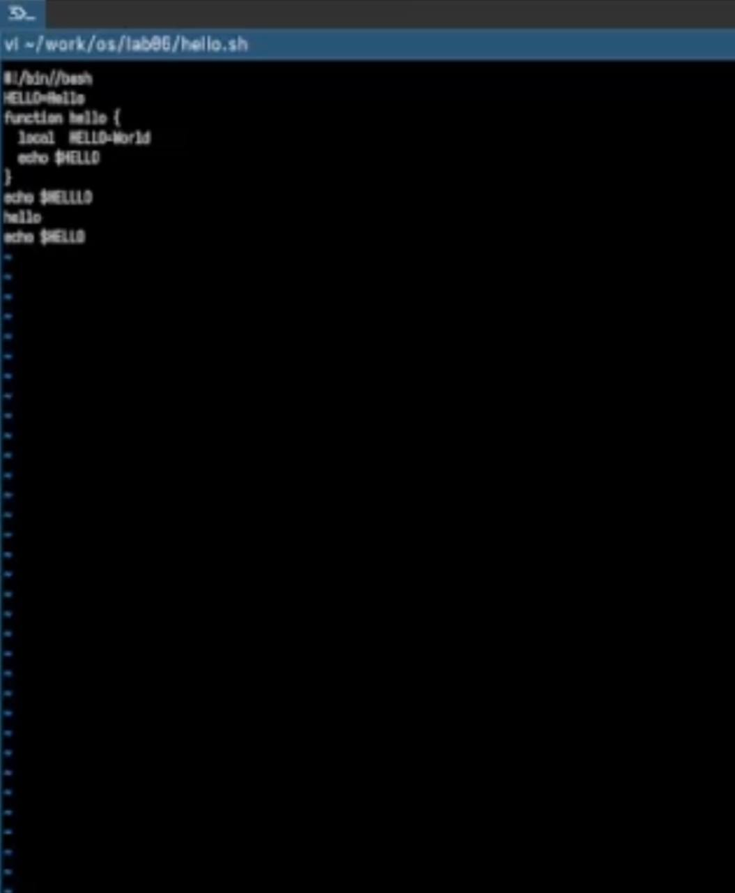

---
## Front matter
title: "Лабораторная работа №10"
author: "Мартынова Милана Александровна"

## Generic options
lang: ru-Ru\
toc-title: "Содержание"

## Bibliography
bibliography: bib/cite.bib
csl: pandoc/csl/gost-r-7-0-5-2008-numeric.csl

## Pdf output format
toc: true # Table of contents
toc-depth: 2
lof: true # List of figures
lot: true # List of tables
fontsize: 12pt
linestretch: 1.5
papersize: a4
documentclass: scrreprt
## I18n polyglossia
polyglossia-lang:
   name: russian
   options:
   - spelling=modern
   - babelshorhands=true
polyglossia-otherlangs:
   name: english
## I18n babel
babel-lang: russian
babel-otherlangs: english
## Fonts
## Fonts
mainfont: Times New Roman
sansfont: Arial
monofont: Courier New
mathfont: Times New Roman
## Biblatex
biblatex: true
biblio-style: "gost-numeric"
biblatexoptions:
   - parentracker=true
   - backend=biber
   - hyperref=auto
   - language=auto
   - autolang=other*
   - citestyle=gost-numeric
## Pandoc-crossref LaTeX customization
figureTitle: "Рис."
tableTitle: "Таблица"
listingTitle: "Листинг"
lofTitle: "Список иллюстраций"
lotTitle: "Список таблиц"
lolTitle: "Листинги"
## Misc options  
indent: true
header-includes:
  - \usepackage{indentfirst}
  - \usepackage{float} # keep figures where there are in the text
  - \floatplacement{figure}{H} # keep figures where there are in the text
---
# 1. Цель работы

Освоить основы операционной системы Linux и отработать на практике навыки работы с редактором vi, который входит в стандартную поставку почти всех дистрибутивов.

# 2. Задание

1. Создайте каталог с именем ~/work/os/lab06.
2. Перейдите во вновь созданный каталог.
3. Вызовите vi и создайте файл hello.sh
4. Нажмите клавишу i и вводите следующий текст.
5. Нажмите клавишу Esc для перехода в командный режим после завершения ввода текста.
6. Нажмите : для перехода в режим последней строки и внизу вашего экрана появится приглашение в виде двоеточия.
7. Нажмите w (записать) и q (выйти), а затем нажмите клавишу Enter для сохранения вашего текста и завершения работы.
8. Сделайте файл исполняемым Задание 2. Редактирование существующего файла
9. Вызовите vi на редактирование файла 1 vi ~/work/os/lab06/hello.sh
10. Установите курсор в конец слова HELL второй строки.
11. Перейдите в режим вставки и замените на HELLO. Нажмите Esc для возврата в команд- ный режим.
12. Установите курсор на четвертую строку и сотрите слово LOCAL.
13. Перейдите в режим вставки и наберите следующий текст: local, нажмите Esc для возврата в командный режим.
14. Установите курсор на последней строке файла. Вставьте после неё строку, содержащую следующий текст: echo $HELLO.
15. Нажмите Esc для перехода в командный режим.
16. Удалите последнюю строку.
17. Введите команду отмены изменений u для отмены последней команды.
18. Введите символ : для перехода в режим последней строки. Запишите произведённые изменения и выйдите из vi.

# 3. Теоретическое введение

В стандартной поставке большинства дистрибутивов Linux присутствует интерактивный экранный редактор vi (Visual display editor). Он функционирует в трёх режимах:
- Командный режим — для навигации по файлу и ввода команд редактирования. 
- Режим вставки — для непосредственного набора и изменения содержимого файла.
- Режим последней (командной) строки — для сохранения изменений и выхода из редактора.
Запуск редактора выполняется командой vi <имя_файла>; если файл не существует, он будет создан. Переключение в командный режим происходит по клавише Esc. Чтобы выйти из редактора, находясь в командном режиме, нажмите Shift-; (то есть двоеточие :), затем введите:
- wq — для выхода с сохранением изменений;
- q (или q!) — для выхода без сохранения.

# 4. Выполнение лабораторной работы

Пишу код из листинга в редакторе.  (рис. 1)

{#fig:001 width=50%}

Изменяю код. (рис. 2)

{#fig:002 width=50%}

# 5. Выводы

Мы освоили основы Linux и приобрели практические навыки работы со встроенным редактором vi, присутствующим почти во всех дистрибутивах.

# Список литературы{.unnumbered}

::: {#refs}
:::