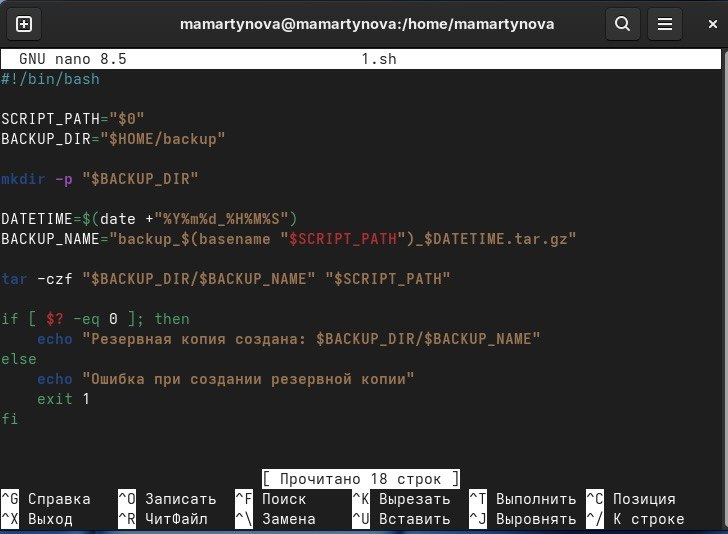
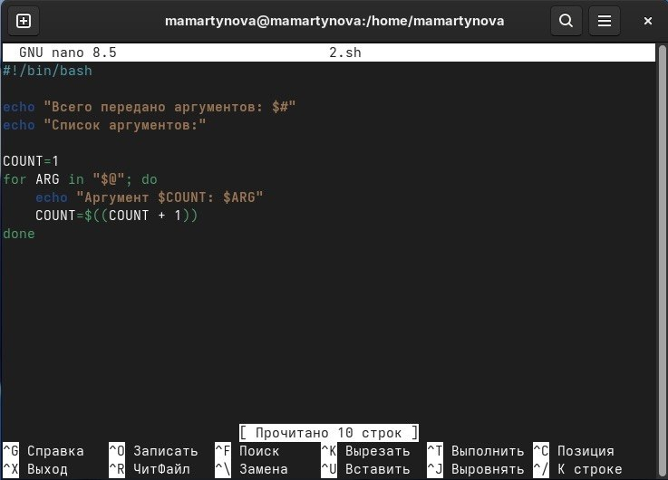
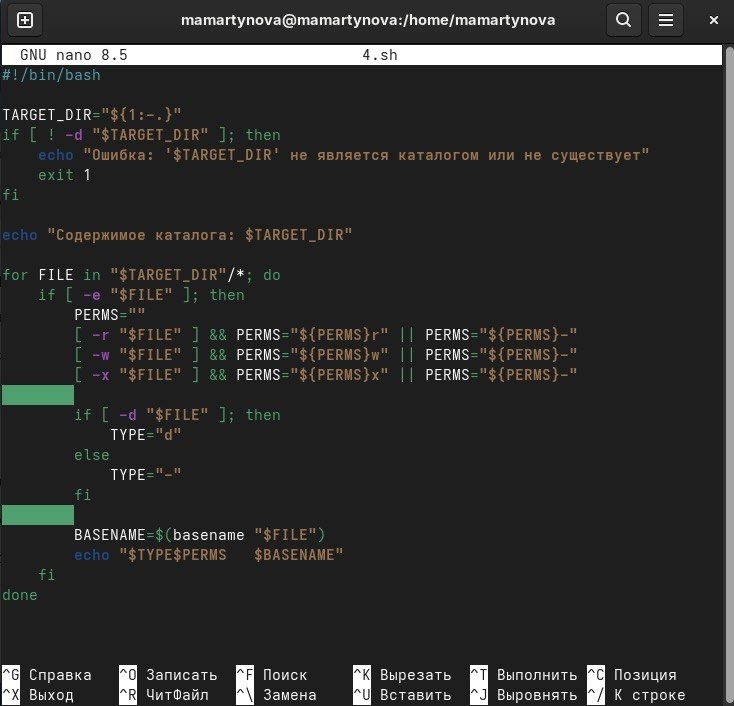
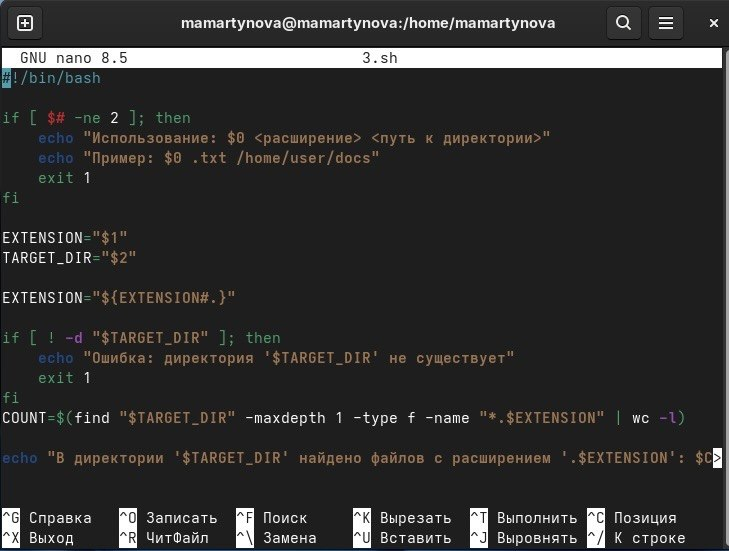
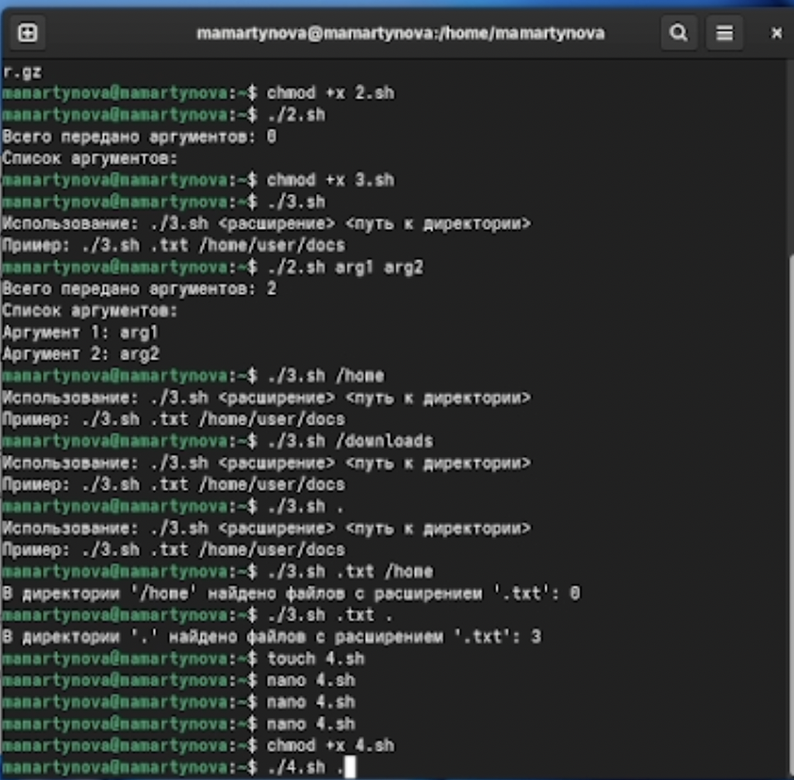

---
## Front matter
lang: ru-RU
title: Лабораторная работа №12
subtitle: Операционные системы
author:
  - Мартынова М.А.
institute:
  - Российский университет дружбы народов, Москва, Россия
date: 30 апреля 2026

## i18n babel
babel-lang: russian
babel-otherlangs: english

## Formatting pdf
toc: false
toc-title: Содержание
slide_level: 2
aspectratio: 169
section-titles: true
theme: default
mainfont: Times New Roman
sansfont: Arial
---

# Информация

## Докладчик

:::::::::::::: {.columns align=center}
::: {.column width="70%"}

  * Мартынова Милана Александровна
  * Студент НКАбд-04-25
  * Российский университет дружбы народов
  * [1032253522@rudn.ru](mailto:1032253522@rudn.ru)

:::

::::::::::::::

# 1. Цель работы

Освоить базовые принципы скриптовой разработки в среде UNIX/Linux и приобрести навыки создания простых сценариев командной оболочки.

# 2. Задание

1. Написать скрипт, который при запуске будет делать резервную копию самого себя (то есть файла, в котором содержится его исходный код) в другую директорию backup в вашем домашнем каталоге. При этом файл должен архивироваться одним из ар- хиваторов на выбор zip, bzip2 или tar. Способ использования команд архивации необходимо узнать, изучив справку.
2. Написать пример командного файла, обрабатывающего любое произвольное число аргументов командной строки, в том числе превышающее десять. Например, скрипт может последовательно распечатывать значения всех переданных аргументов.
3. Написать командный файл — аналог команды ls (без использования самой этой ко- манды и команды dir). Требуется, чтобы он выдавал информацию о нужном каталоге и выводил информацию о возможностях доступа к файлам этого каталога.
4. Написать командный файл, который получает в качестве аргумента командной строки формат файла (.txt, .doc, .jpg, .pdf и т.д.) и вычисляет количество таких файлов в указанной директории. Путь к директории также передаётся в виде аргумента ко- мандной строки.

# 3. Теоретическое введение

Командный интерпретатор (shell) представляет собой программу, обеспечивающую интерфейс взаимодействия пользователя с операционной системой. В среде UNIX/Linux распространены следующие разновидности оболочек:
- Bourne shell (sh) — базовая стандартная оболочка с минимальным, но достаточным набором функций.
- C shell (csh) — расширение sh с синтаксисом, напоминающим язык C, и поддержкой истории команд.
- Korn shell (ksh) — гибрид, где управляющие операторы аналогичны sh, а остальные возможности близки к csh.
- BASH (Bourne Again Shell) — разработка Free Software Foundation, объединяющая свойства csh и ksh.
Отдельно выделяется стандарт POSIX (разработан IEEE), определяющий единые интерфейсы для совместимости UNIX-подобных ОС и переносимости приложений на уровне исходного кода. POSIX-совместимые оболочки базируются на оболочке Корна.

# 4. Выполнение лабораторной работы

1. Написать скрипт, который при запуске будет делать резервную копию самого себя (то есть файла, в котором содержится его исходный код) в другую директорию backup в вашем домашнем каталоге. При этом файл должен архивироваться одним из ар- хиваторов на выбор zip, bzip2 или tar. Способ использования команд архивации необходимо узнать, изучив справку.  (рис. 1)

{#fig:001 width=40%}

---

2. Написать пример командного файла, обрабатывающего любое произвольное число аргументов командной строки, в том числе превышающее десять. Например, скрипт может последовательно распечатывать значения всех переданных аргументов.(рис. 2)

{#fig:002 width=40%}

---

3. Написать командный файл — аналог команды ls (без использования самой этой ко- манды и команды dir). Требуется, чтобы он выдавал информацию о нужном каталоге и выводил информацию о возможностях доступа к файлам этого каталога.(рис. 3)

{#fig:003 width=40%}

---

Написать командный файл, который получает в качестве аргумента командной строки формат файла (.txt, .doc, .jpg, .pdf и т.д.) и вычисляет количество таких файлов в указанной директории. Путь к директории также передаётся в виде аргумента ко- мандной строки. (рис. 4)

{#fig:004 width=40%}

---

Делаю файлы исполняемыми и запускаю. (рис. 5)

{#fig:005 width=40%}

# 5. Выводы

Нами освоены основы shell-программирования в UNIX/Linux и приобретены навыки написания простых скриптов.
