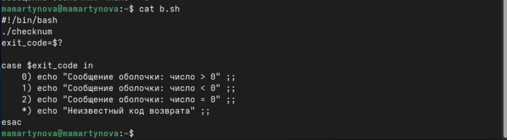
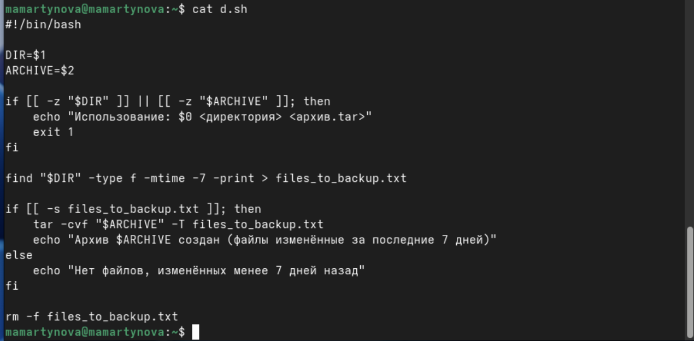

---
## Front matter
lang: ru-RU
title: Лабораторная работа №13
subtitle: Операционные системы
author:
  - Мартынова М.А.
institute:
  - Российский университет дружбы народов, Москва, Россия
date: 7 мая 2026

## i18n babel
babel-lang: russian
babel-otherlangs: english

## Formatting pdf
toc: false
toc-title: Содержание
slide_level: 2
aspectratio: 169
section-titles: true
theme: default
mainfont: Times New Roman
sansfont: Arial
---

# Информация

## Докладчик

:::::::::::::: {.columns align=center}
::: {.column width="70%"}

  * Мартынова Милана Александровна
  * Студент НКАбд-04-25
  * Российский университет дружбы народов
  * [1032253522@rudn.ru](mailto:1032253522@rudn.ru)

:::

::::::::::::::
# 1. Цель работы

Освоить базовые принципы программирования в оболочке UNIX и научиться писать сложные сценарии (командные файлы), используя логические конструкции и циклы.

# 2. Задание

1. Используя команды getopts grep, написать командный файл, который анализирует командную строку с ключами: – -iinputfile — прочитать данные из указанного файла; – -ooutputfile — вывести данные в указанный файл; – -pшаблон — указать шаблон для поиска; – -C — различать большие и малые буквы; – -n — выдавать номера строк. а затем ищет в указанном файле нужные строки, определяемые ключом -p.
2. Написать на языке Си программу, которая вводит число и определяет, является ли оно больше нуля, меньше нуля или равно нулю. Затем программа завершается с помощью функции exit(n), передавая информацию в о коде завершения в оболочку. Команд- ный файл должен вызывать эту программу и, проанализировав с помощью команды $?, выдать сообщение о том, какое число было введено.

---

3. Написать командный файл, создающий указанное число файлов, пронумерованных последовательно от 1 до 𝑁 (например 1.tmp, 2.tmp, 3.tmp,4.tmp и т.д.). Число файлов, которые необходимо создать, передаётся в аргументы командной строки. Этот же ко- мандный файл должен уметь удалять все созданные им файлы (если они существуют).
4. Написать командный файл, который с помощью команды tar запаковывает в архив все файлы в указанной директории. Модифицировать его так, чтобы запаковывались только те файлы, которые были изменены менее недели тому назад (использовать команду find).

# 3. Теоретическое введение

Bash — это популярная командная оболочка UNIX, обеспечивающая интерактивную работу с командами и возможность написания скриптов для автоматизации. Её ключевые особенности: обработка простых и сложных команд (конвейеры, перенаправление, if/else, while), удобный ввод с автодополнением и историей, а также создание исполняемых скриптов с циклами и функциями. Работает в Unix/Linux и Windows (через WSL).

# 4. Выполнение лабораторной работы

1. Используя команды getopts grep, написать командный файл, который анализирует командную строку с ключами: – -iinputfile — прочитать данные из указанного файла; – -ooutputfile — вывести данные в указанный файл; – -pшаблон — указать шаблон для поиска; – -C — различать большие и малые буквы; – -n — выдавать номера строк. а затем ищет в указанном файле нужные строки, определяемые ключом -p.(рис. 1)

{#fig:001 width=37%}

---

2. Написать на языке Си программу, которая вводит число и определяет, является ли оно больше нуля, меньше нуля или равно нулю. Затем программа завершается с помощью функции exit(n), передавая информацию в о коде завершения в оболочку. Команд- ный файл должен вызывать эту программу и, проанализировав с помощью команды $?, выдать сообщение о том, какое число было введено.(рис. 2)

{#fig:002 width=70%}

---

3. Написать командный файл, создающий указанное число файлов, пронумерованных последовательно от 1 до 𝑁 (например 1.tmp, 2.tmp, 3.tmp,4.tmp и т.д.). Число файлов, которые необходимо создать, передаётся в аргументы командной строки. Этот же ко- мандный файл должен уметь удалять все созданные им файлы (если они существуют).(рис. 3)

{#fig:003 width=60%}

---

4. Написать командный файл, который с помощью команды tar запаковывает в архив все файлы в указанной директории. Модифицировать его так, чтобы запаковывались только те файлы, которые были изменены менее недели тому назад (использовать команду find).
(рис. 4)

{#fig:004 width=70%}

---

Делаю файлы исполняемыми и запускаю. (рис. 5)

{#fig:005 width=40%}

# 5. Выводы

Мы освоили базу программирования в оболочке UNIX и приобрели навыки написания усложнённых командных скриптов, применяя логические конструкции и циклы.