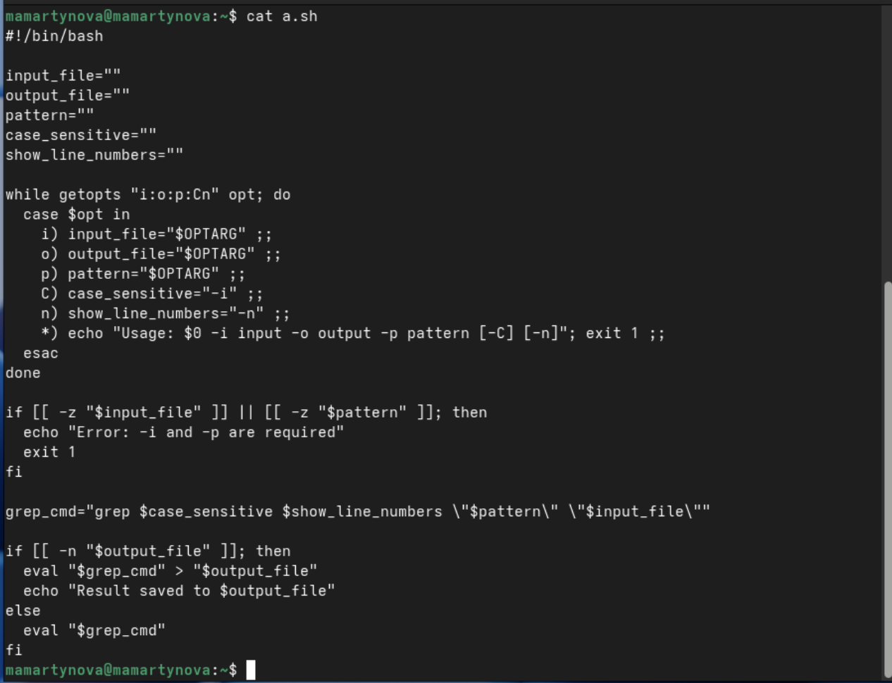
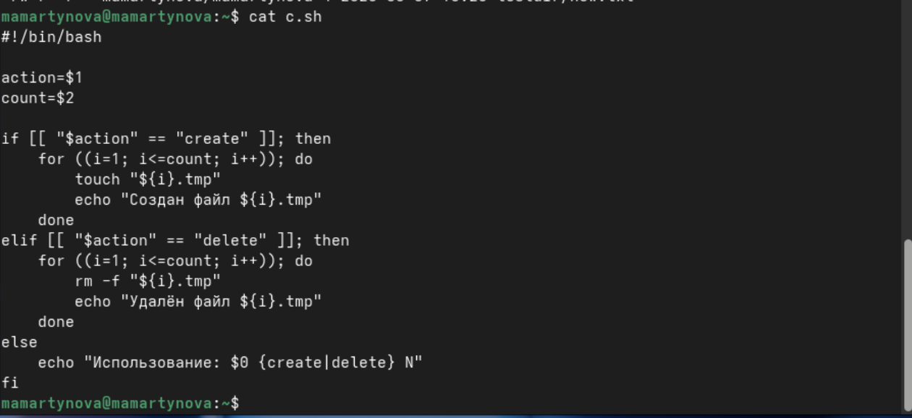
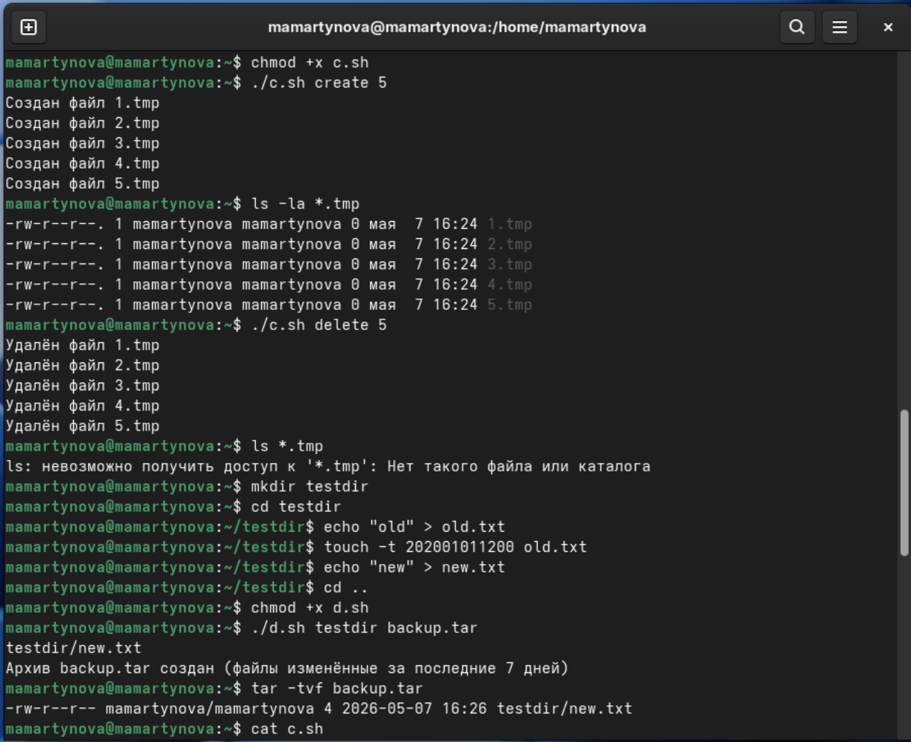

---
## Front matter
title: "Лабораторная работа №13"
author: "Мартынова Милана Александровна"

## Generic options
lang: ru-Ru\
toc-title: "Содержание"

## Bibliography
bibliography: bib/cite.bib
csl: pandoc/csl/gost-r-7-0-5-2008-numeric.csl

## Pdf output format
toc: true # Table of contents
toc-depth: 2
lof: true # List of figures
lot: true # List of tables
fontsize: 12pt
linestretch: 1.5
papersize: a4
documentclass: scrreprt
## I18n polyglossia
polyglossia-lang:
   name: russian
   options:
   - spelling=modern
   - babelshorhands=true
polyglossia-otherlangs:
   name: english
## I18n babel
babel-lang: russian
babel-otherlangs: english
## Fonts
## Fonts
mainfont: Times New Roman
sansfont: Arial
monofont: Courier New
mathfont: Times New Roman
## Biblatex
biblatex: true
biblio-style: "gost-numeric"
biblatexoptions:
   - parentracker=true
   - backend=biber
   - hyperref=auto
   - language=auto
   - autolang=other*
   - citestyle=gost-numeric
## Pandoc-crossref LaTeX customization
figureTitle: "Рис."
tableTitle: "Таблица"
listingTitle: "Листинг"
lofTitle: "Список иллюстраций"
lotTitle: "Список таблиц"
lolTitle: "Листинги"
## Misc options  
indent: true
header-includes:
  - \usepackage{indentfirst}
  - \usepackage{float} # keep figures where there are in the text
  - \floatplacement{figure}{H} # keep figures where there are in the text
---
# 1. Цель работы

Освоить базовые принципы программирования в оболочке UNIX и научиться писать сложные сценарии (командные файлы), используя логические конструкции и циклы.

# 2. Задание

1. Используя команды getopts grep, написать командный файл, который анализирует командную строку с ключами: – -iinputfile — прочитать данные из указанного файла; – -ooutputfile — вывести данные в указанный файл; – -pшаблон — указать шаблон для поиска; – -C — различать большие и малые буквы; – -n — выдавать номера строк. а затем ищет в указанном файле нужные строки, определяемые ключом -p.
2. Написать на языке Си программу, которая вводит число и определяет, является ли оно больше нуля, меньше нуля или равно нулю. Затем программа завершается с помощью функции exit(n), передавая информацию в о коде завершения в оболочку. Команд- ный файл должен вызывать эту программу и, проанализировав с помощью команды $?, выдать сообщение о том, какое число было введено.
3. Написать командный файл, создающий указанное число файлов, пронумерованных последовательно от 1 до 𝑁 (например 1.tmp, 2.tmp, 3.tmp,4.tmp и т.д.). Число файлов, которые необходимо создать, передаётся в аргументы командной строки. Этот же ко- мандный файл должен уметь удалять все созданные им файлы (если они существуют).
4. Написать командный файл, который с помощью команды tar запаковывает в архив все файлы в указанной директории. Модифицировать его так, чтобы запаковывались только те файлы, которые были изменены менее недели тому назад (использовать команду find).

# 3. Теоретическое введение

Bash — это популярная командная оболочка UNIX, обеспечивающая интерактивную работу с командами и возможность написания скриптов для автоматизации. Её ключевые особенности: обработка простых и сложных команд (конвейеры, перенаправление, if/else, while), удобный ввод с автодополнением и историей, а также создание исполняемых скриптов с циклами и функциями. Работает в Unix/Linux и Windows (через WSL).

# 4. Выполнение лабораторной работы

1. Используя команды getopts grep, написать командный файл, который анализирует командную строку с ключами: – -iinputfile — прочитать данные из указанного файла; – -ooutputfile — вывести данные в указанный файл; – -pшаблон — указать шаблон для поиска; – -C — различать большие и малые буквы; – -n — выдавать номера строк. а затем ищет в указанном файле нужные строки, определяемые ключом -p.(рис. 1)

{#fig:001 width=70%}

2. Написать на языке Си программу, которая вводит число и определяет, является ли оно больше нуля, меньше нуля или равно нулю. Затем программа завершается с помощью функции exit(n), передавая информацию в о коде завершения в оболочку. Команд- ный файл должен вызывать эту программу и, проанализировав с помощью команды $?, выдать сообщение о том, какое число было введено.(рис. 2)

{#fig:002 width=70%}

3. Написать командный файл, создающий указанное число файлов, пронумерованных последовательно от 1 до 𝑁 (например 1.tmp, 2.tmp, 3.tmp,4.tmp и т.д.). Число файлов, которые необходимо создать, передаётся в аргументы командной строки. Этот же ко- мандный файл должен уметь удалять все созданные им файлы (если они существуют).(рис. 3)

{#fig:003 width=70%}

4. Написать командный файл, который с помощью команды tar запаковывает в архив все файлы в указанной директории. Модифицировать его так, чтобы запаковывались только те файлы, которые были изменены менее недели тому назад (использовать команду find).
(рис. 4)

{#fig:004 width=70%}

Делаю файлы исполняемыми и запускаю. (рис. 5)

{#fig:005 width=70%}

# 5. Выводы

Мы освоили базу программирования в оболочке UNIX и приобрели навыки написания усложнённых командных скриптов, применяя логические конструкции и циклы.

# Список литературы{.unnumbered}

::: {#refs}
:::