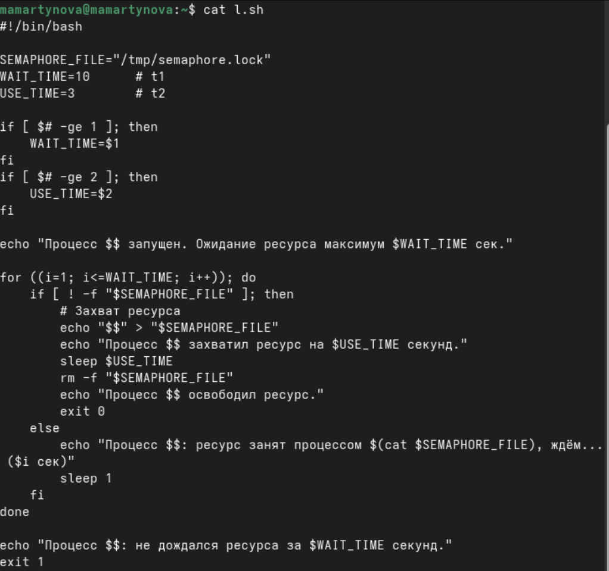
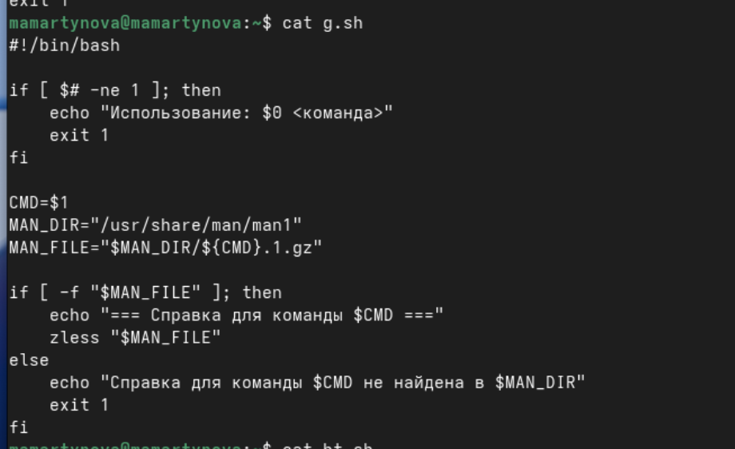
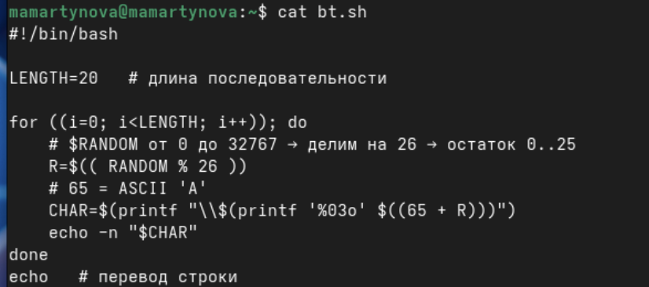

---
## Front matter
lang: ru-RU
title: Лабораторная работа №14
subtitle: Операционные системы
author:
  - Мартынова М.А.
institute:
  - Российский университет дружбы народов, Москва, Россия
date: 16 мая 2026

## i18n babel
babel-lang: russian
babel-otherlangs: english

## Formatting pdf
toc: false
toc-title: Содержание
slide_level: 2
aspectratio: 169
section-titles: true
theme: default
mainfont: Times New Roman
sansfont: Arial
---

# Информация

## Докладчик

:::::::::::::: {.columns align=center}
::: {.column width="70%"}

  * Мартынова Милана Александровна
  * Студент НКАбд-04-25
  * Российский университет дружбы народов
  * [1032253522@rudn.ru](mailto:1032253522@rudn.ru)

:::

::::::::::::::

# 1. Цель работы

Изучить основы программирования в оболочке ОС UNIX. Научиться писать более сложные командные файлы с использованием логических управляющих конструкций и циклов.

# 2. Задание

1. Написать командный файл, реализующий упрощённый механизм семафоров. Ко- мандный файл должен в течение некоторого времени t1 дожидаться освобождения ресурса, выдавая об этом сообщение, а дождавшись его освобождения, использовать его в течение некоторого времени t2<>t1, также выдавая информацию о том, что ресурс используется соответствующим командным файлом (процессом). Запустить командный файл в одном виртуальном терминале в фоновом режиме, перенаправив его вывод в другой (> /dev/tty#, где # — номер терминала куда перенаправляется вывод), в котором также запущен этот файл, но не фоновом, а в привилегированном режиме. Доработать программу так, чтобы имелась возможность взаимодействия трёх и более процессов.

---

2. Реализовать команду man с помощью командного файла. Изучите содержимое ката- лога /usr/share/man/man1. В нем находятся архивы текстовых файлов, содержащих справку по большинству установленных в системе программ и команд. Каждый архив можно открыть командой less сразу же просмотрев содержимое справки. Командный файл должен получать в виде аргумента командной строки название команды и в виде результата выдавать справку об этой команде или сообщение об отсутствии справки, если соответствующего файла нет в каталоге man1.
3. Используя встроенную переменную $RANDOM, напишите командный файл, генерирую- щий случайную последовательность букв латинского алфавита. Учтите, что $RANDOM выдаёт псевдослучайные числа в диапазоне от 0 до 32767.

# 3. Теоретическое введение

Командный процессор (командная оболочка, интерпретатор команд shell) — это про- грамма, позволяющая пользователю взаимодействовать с операционной системой компьютера. В операционных системах типа UNIX/Linux наиболее часто используются следующие реализации командных оболочек: – оболочка Борна (Bourne shell или sh) — стандартная командная оболочка UNIX/Linux, содержащая базовый, но при этом полный набор функций; – С-оболочка (или csh) — надстройка на оболочкой Борна, использующая С-подобный синтаксис команд с возможностью сохранения истории выполнения команд; – оболочка Корна (или ksh) — напоминает оболочку С, но операторы управления програм- мой совместимы с операторами оболочки Борна; – BASH — сокращение от Bourne Again Shell (опять оболочка Борна), в основе своей сов- мещает свойства оболочек С и Корна (разработка компании Free Software Foundation).

---

 POSIX (Portable Operating System Interface for Computer Environments) — набор стандартов описания интерфейсов взаимодействия операционной системы и прикладных программ. Стандарты POSIX разработаны комитетом IEEE (Institute of Electrical and Electronics Engineers) для обеспечения совместимости различных UNIX/Linux-подобных опера- ционных систем и переносимости прикладных программ на уровне исходного кода. POSIX-совместимые оболочки разработаны на базе оболочки Корна.

# 4. Выполнение лабораторной работы

1. Написать командный файл, реализующий упрощённый механизм семафоров. Командный файл должен в течение некоторого времени t1 дожидаться освобождения ресурса, выдавая об этом сообщение, а дождавшись его освобождения, использовать его в течение некоторого времени, также выдавая информацию о том, что ресурс используется соответствующим командным файлом (процессом). Запустить командный файл в одном виртуальном терминале в фоновом режиме, перенаправив его вывод в другой , в котором также запущен этот файл, но не фоновом, а в привилегированном режиме. Доработать программу так, чтобы имелась возможность взаимодействия трёх и более процессов.(рис. 1)

{#fig:001 width=20%}

---

2. Реализовать команду man с помощью командного файла. Изучите содержимое ката- лога /usr/share/man/man1. В нем находятся архивы текстовых файлов, содержащих справку по большинству установленных в системе программ и команд. Каждый архив можно открыть командой less сразу же просмотрев содержимое справки. Командный файл должен получать в виде аргумента командной строки название команды и в виде результата выдавать справку об этой команде или сообщение об отсутствии справки, если соответствующего файла нет в каталоге man1.(рис. 2)

{#fig:002 width=30%}

---

3. Используя встроенную переменную $RANDOM, напишите командный файл, генерирую- щий случайную последовательность букв латинского алфавита. Учтите, что $RANDOM выдаёт псевдослучайные числа в диапазоне от 0 до 32767.
(рис. 3)

{#fig:003 width=70%}

# 5. Выводы

Мы изучили основы программирования в оболочке ОС UNIX. Научились писать более сложные командные файлы с использованием логических управляющих конструкций и циклов
