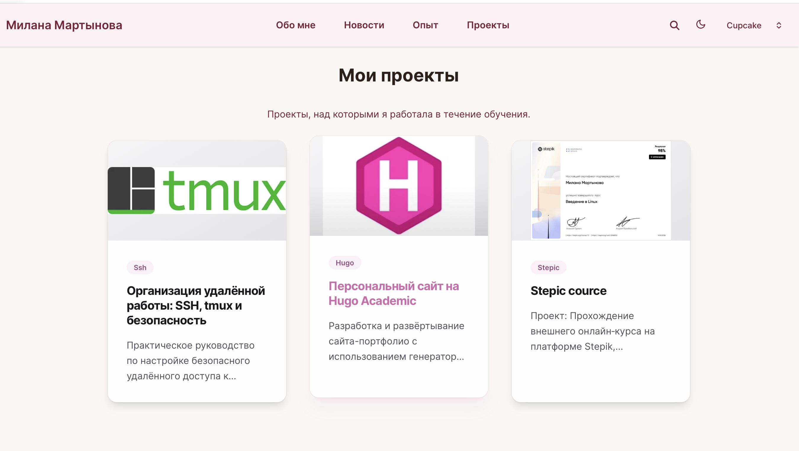
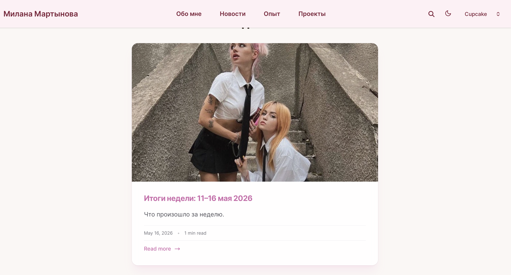
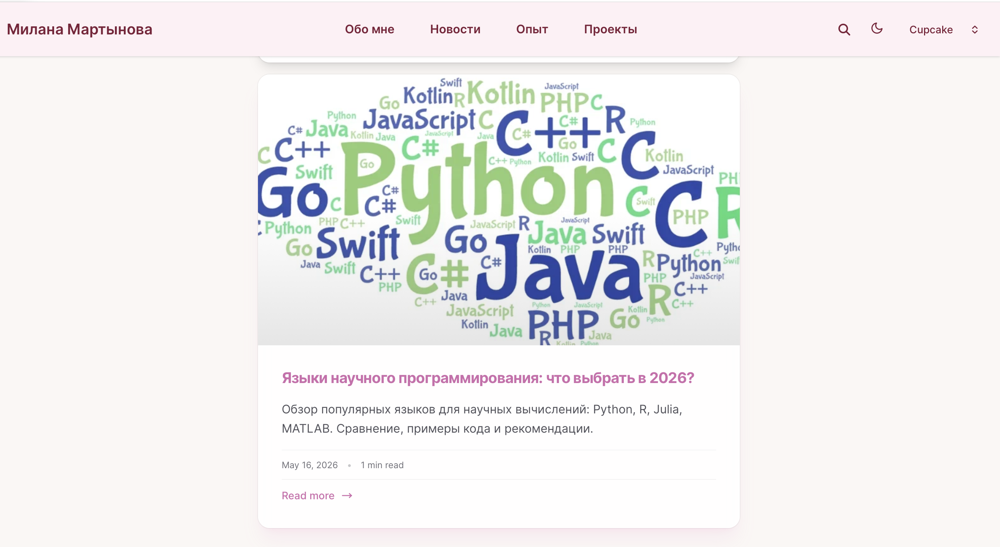

---
## Front matter
lang: ru-RU
title: Индивидуальный проект 5 этап
subtitle: Операционные системы
author:
  - Мартынова М.А.
institute:
  - Российский университет дружбы народов, Москва, Россия
date: 16 мая 2026

## i18n babel
babel-lang: russian
babel-otherlangs: english

## Formatting pdf
toc: false
toc-title: Содержание
slide_level: 2
aspectratio: 169
section-titles: true
theme: default
mainfont: Times New Roman
sansfont: Arial
---

# Информация

## Докладчик

:::::::::::::: {.columns align=center}
::: {.column width="70%"}

  * Мартынова Милана Александровна
  * Студент НКАбд-04-25
  * Российский университет дружбы народов
  * [1032253522@rudn.ru](mailto:1032253522@rudn.ru)

:::

::::::::::::::
# 1. Цель работы

Продолжить работу с сайтом, добавить личные достижения и два новых поста

# 2. Задание

1. Сделать записи для персональных проектов.
2. Сделать пост по прошедшей неделе.
3. Добавить пост на тему по выбору: Языки научного программирования.

# 3. Выполнение лабораторной работы

Проверяю изменения на сайте:

Добавление проетков (рис. 1)

{#fig:001 width=70%}

---

Проверяю добавление поста о прошедшей неделе. (рис. 2)

{#fig:002 width=70%}

---

Проверяю добавление поста про языки программирования. (рис. 3)

{#fig:003 width=70%}

# 4. Выводы

Мы продолжили работу с сайтом, добавили проекты.