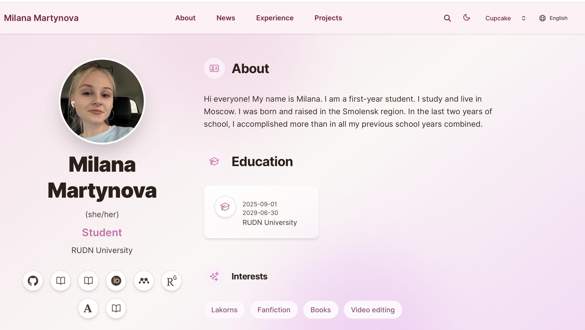
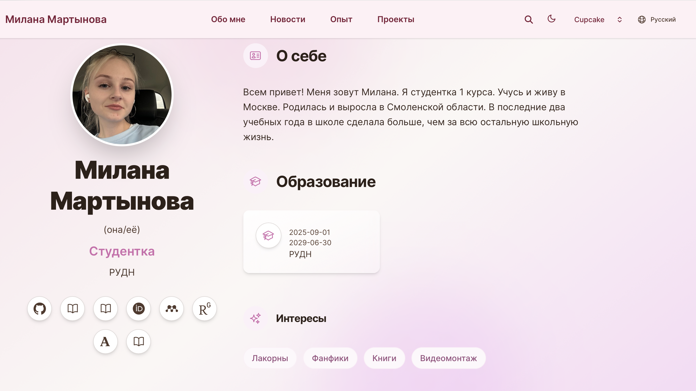

---
## Front matter
lang: ru-RU
title: Индивидуальный проект 6 этап
subtitle: Операционные системы
author:
  - Мартынова М.А.
institute:
  - Российский университет дружбы народов, Москва, Россия
date: 27 мая 2026

## i18n babel
babel-lang: russian
babel-otherlangs: english

## Formatting pdf
toc: false
toc-title: Содержание
slide_level: 2
aspectratio: 169
section-titles: true
theme: default
mainfont: Times New Roman
sansfont: Arial
---

# Информация

## Докладчик

:::::::::::::: {.columns align=center}
::: {.column width="70%"}

  * Мартынова Милана Александровна
  * Студент НКАбд-04-25
  * Российский университет дружбы народов
  * [1032253522@rudn.ru](mailto:1032253522@rudn.ru)

:::

::::::::::::::

# 1. Цель работы

Продолжить работу с сайтом, добавить переключение языка и два новых поста

# 2. Задание

1. Сделать поддержку английского и русского языков.
2. Разместить элементы сайта на обоих языках.
3. Разместить контент на обоих языках.
4. Сделать пост по прошедшей неделе.
5. Добавить пост на тему по выбору (на двух языках).

# 3. Выполнение лабораторной работы

Проверяю изменения на сайте:

Английский язык (рис. 1)

{#fig:001 width=70%}

---

Русский язык (рис. 2)

{#fig:002 width=70%}

---

Проверяю добавление поста о прошедшей неделе. (рис. 3)

{#fig:003 width=70%}

---

Проверяю добавление поста про Obsidian. (рис. 4)

{#fig:004 width=70%}

# 4. Выводы

Мы закончили работу с сайтом, добавили переключение языков.
