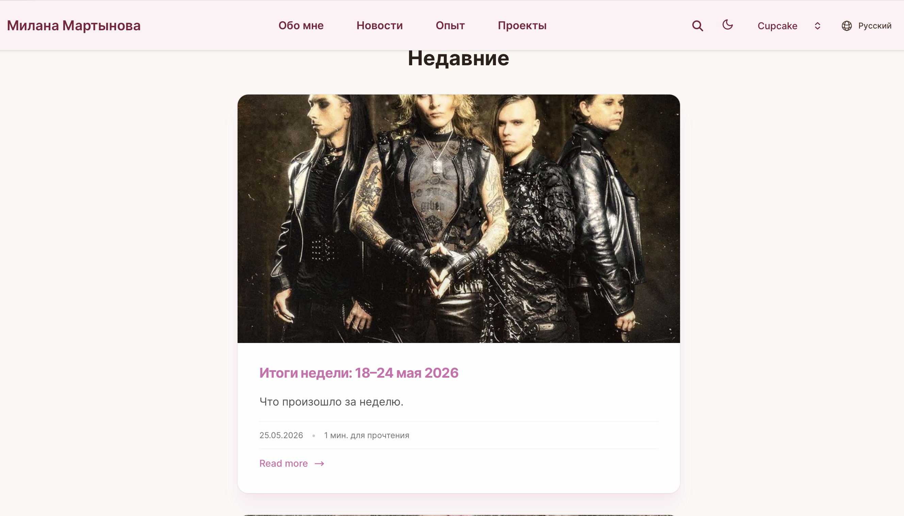
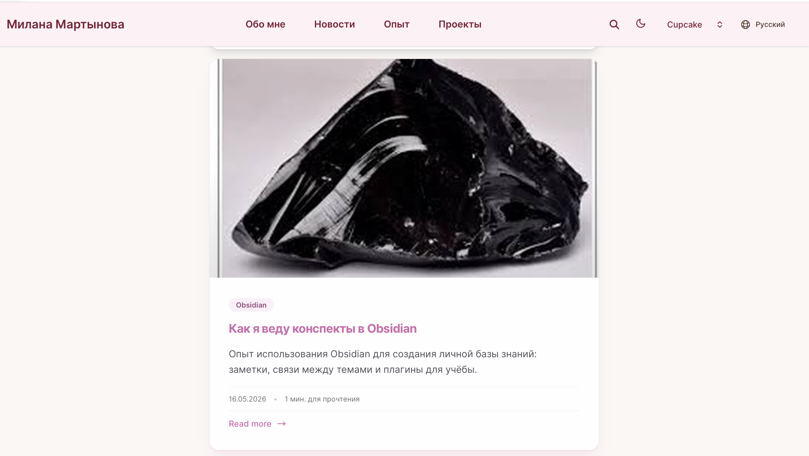

---
## Front matter
title: "Индивидуальный проект 6 этап"
author: "Мартынова Милана Александровна"

## Generic options
lang: ru-Ru\
toc-title: "Содержание"

## Bibliography
bibliography: bib/cite.bib
csl: pandoc/csl/gost-r-7-0-5-2008-numeric.csl

## Pdf output format
toc: true # Table of contents
toc-depth: 2
lof: true # List of figures
lot: true # List of tables
fontsize: 12pt
linestretch: 1.5
papersize: a4
documentclass: scrreprt
## I18n polyglossia
polyglossia-lang:
   name: russian
   options:
   - spelling=modern
   - babelshorhands=true
polyglossia-otherlangs:
   name: english
## I18n babel
babel-lang: russian
babel-otherlangs: english
## Fonts
## Fonts
mainfont: Times New Roman
sansfont: Arial
monofont: Courier New
mathfont: Times New Roman
## Biblatex
biblatex: true
biblio-style: "gost-numeric"
biblatexoptions:
   - parentracker=true
   - backend=biber
   - hyperref=auto
   - language=auto
   - autolang=other*
   - citestyle=gost-numeric
## Pandoc-crossref LaTeX customization
figureTitle: "Рис."
tableTitle: "Таблица"
listingTitle: "Листинг"
lofTitle: "Список иллюстраций"
lotTitle: "Список таблиц"
lolTitle: "Листинги"
## Misc options  
indent: true
header-includes:
  - \usepackage{indentfirst}
  - \usepackage{float} # keep figures where there are in the text
  - \floatplacement{figure}{H} # keep figures where there are in the text
---
# 1. Цель работы

Продолжить работу с сайтом, добавить переключение языка и два новых поста

# 2. Задание

1. Сделать поддержку английского и русского языков.
2. Разместить элементы сайта на обоих языках.
3. Разместить контент на обоих языках.
4. Сделать пост по прошедшей неделе.
5. Добавить пост на тему по выбору (на двух языках).

# 3. Выполнение лабораторной работы

Проверяю изменения на сайте:

Английский язык (рис. 1)

{#fig:001 width=70%}

Русский язык (рис. 2)

{#fig:002 width=70%}

Проверяю добавление поста о прошедшей неделе. (рис. 3)

{#fig:003 width=70%}

Проверяю добавление поста про Obsidian. (рис. 4)

{#fig:004 width=70%}

# 4. Выводы

Мы закончили работу с сайтом, добавили переключение языков.

# Список литературы{.unnumbered}

::: {#refs}
:::